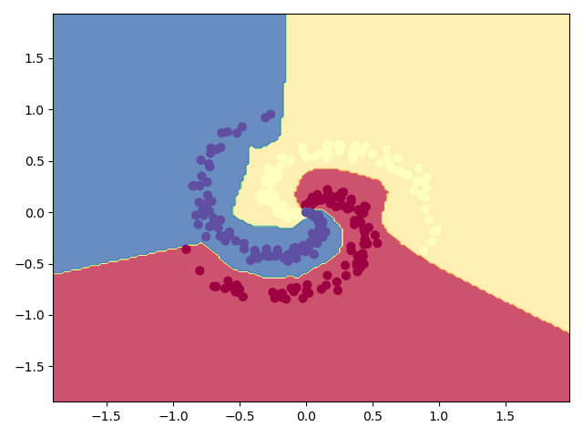
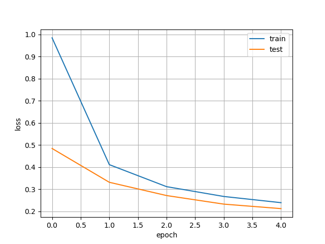
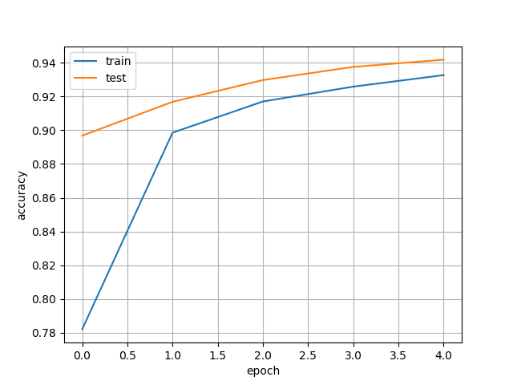
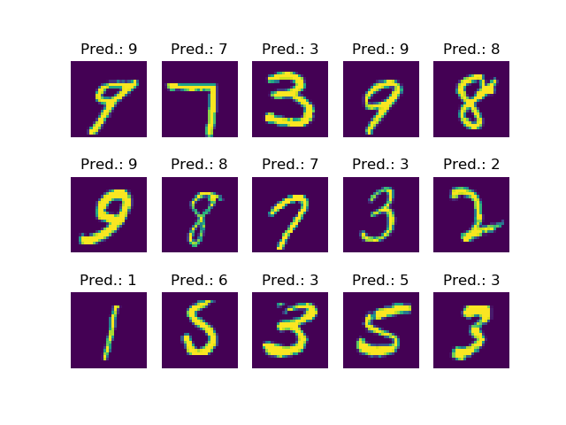
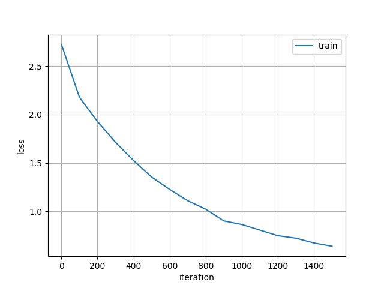
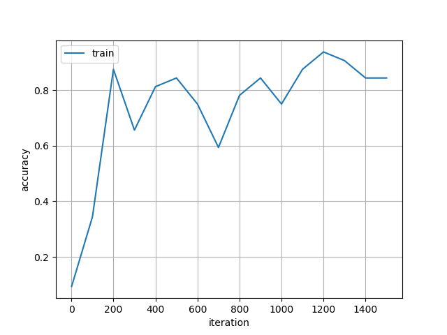
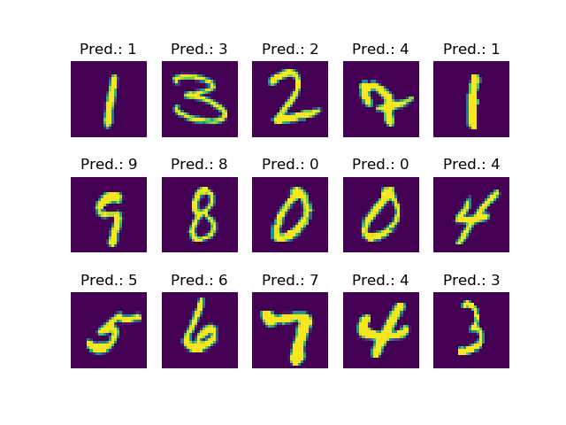

# Examples
In this folder you can find example tasks solvable with the implemented modules.
To reproduce, simply run the scripts. But be *warned*, that some of the task may take a while to complete.

## Basic classification task with a FCN
Classification of spiral formed toy data with a two-layered fully connected network.
This task is similar to 'https://cs.stanford.edu/people/karpathy/cs231nfiles/minimal_net.html'

Result:

## Basic regression task with a FCN
The regression task tries to simulate a sine curve with a two layer FCN and learns with examples in the range from 0 to 10.

Result:

## MNIST Classification with a CNN
Train a simple CNN with a 7x7 Convolutional Layer, 4x4 Max-Pooling, and two FC-Layers on MNIST to classify single digits between 0 and 9.

### Full training
The full training provides a script to train the CNN on multiple epochs over the full dataset with minibatches. 
Since the network runs completely on NumPy, the training is of course much slower than real frameworks for Machine Learning (i.e. PyTorch or Tensorflow) need for this task.
However, the task is designed to be equal to a beginner TensorFlow 2 tutorial ('https://www.tensorflow.org/tutorials/quickstart/advanced').

Results:

| Loss | Accuracy |
| --- | --- |
|  |  |

| Example prediction |
| --- |
|  |

| Epoch | Train Loss | Train Accuracy | Test Loss | Test Accuracy |
| --- | --- | --- | --- | --- |
| 1 | 0.9847 | 78.201% | 0.4840 | 89.682% | 
| 2 | 0.4109 | 89.858% | 0.3311 | 91.688% | 
| 3 | 0.3113 | 91.708% | 0.2711 | 92.980% | 
| 4 | 0.2669 | 92.589% | 0.2323 | 93.760% | 
| 5 | 0.2388 | 93.271% | 0.2119 | 94.189% | 

### Small training (simple)
The simpler version of the script, enables training on a specified number of iterations on the shuffled dataset with minibatches. 
Even if it is of course not as fast as the real frameworks, you can see results earlier than in the full version.

Results:

| Loss | Accuracy |
| --- | --- |
|  |  |

| Example prediction |
| --- |
|  |
